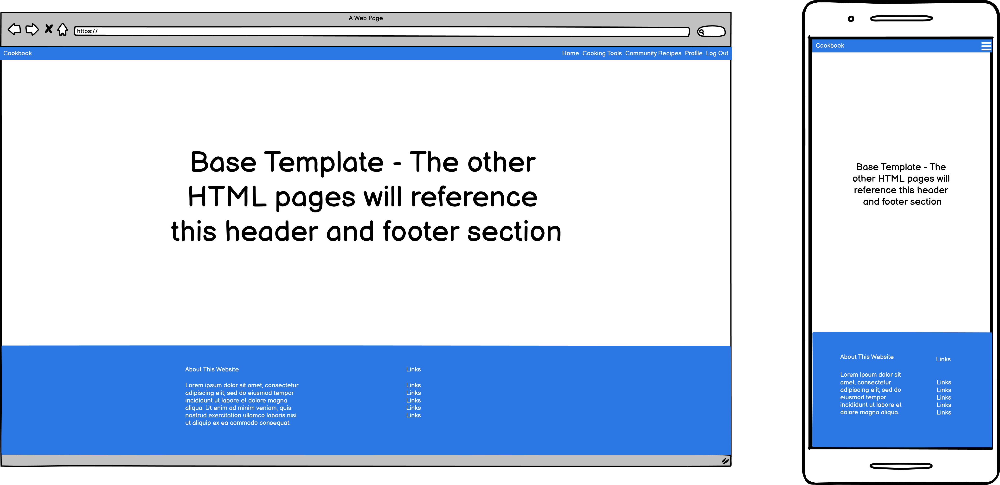

# MS3---Online-Cookbook

# The Veggie Guy - Cookbook

# Contents

## [1. Project Status](#project-status "1. Project Status")
## [2. User Story](#user-story "2. User Story")
    * 2.1 The Business Case (Project Goals)
    * 2.2 Wireframes
## [3. Features](#features "3. Features")
    * 3.1 Existing Features
    * 3.2 Features Left to Implement
    * 3.3 Technologies Used
## [4. Deployment](#deployment "4. Deployment")
    * 4.1 Local
## [5. Credits](#credits "5. Credits")
    * 5.1 Content
    * 5.2 Media
    * 5.3 Acknowledgements
## [6. Lessons Learnt](#lessons-learnt "6. Lessons Learnt")
    * 6.1 Lessons
    * 6.2 Future Study Points
## [Testing Information](#testing-information "Testing Information")

#
# Project Status

    The deadline for this project is 19/03/2022.
    The project is currently work in progress. 
    * Most of the structure is in place
    * Some changes to the CSS are required in order to fix display issues
    * Testing needs to be created and completed
    * Some wording changes need to be completed in the python code. 
        At the moment it says info for info which is bad practice
    
    Update as of - 13/03/2022
    * CRUD functionality seems to be working.
        The user can now create, edit, delete and update recipes
    * The community recipe page is currently looping through ALL users in the database
        and repeating recipes
    * ReadMe is in a good position with small updates and spelling checks required
    * Testing needs to be created and completed.
    * Need to tidy up code structure and layout

   

 
 
 

## [Go To Top](#contents "Go To Top")

# User Story
## 2.1 The business case (Project Goals):

    This website has been designed to give the user the ability to record, ammend and view recipes online anywhere.
    
    The owner of the site is also looking to promote a brand of cooking utensils. 
    
    The website owner would like to generate additional traffic to his website to help increase sales. 
    
    In order to do so the site needs to have the ability to bring users back. 
    
    This will be achieved by allowing the user to create and save recipes that they can access anywhere.

## 2.2 Wireframes

## Sitemap

## Wireframes

## 2.3 Website Objectives:

    * Promote a brand of cooking untensils
    * Allow the user to create a profile
    * Within this profile the user should be able to create and save their own recipes and the assoicated information
    * The user should be able to delete and edit recipes they have created
    * The user should be able to browse community approved recipes
    * The user should be able to log into their profile on any device and easily view their recipes

## 2.4 Design Inspiration

    The design inspiration came from the mini project in the code insitute course. 
    I used a combination of https://materializecss.com/ and the template provided by the course 
        to come up with the main structure for the site.

 
 
 

## [Go To Top](#contents "Go To Top")

# Features

## 3.1 Existing Features

    * Browse community recipe's
    * Browse a selection of cooking tools
    * Create a user profile
    * Create, edit and delete recipes

## 3.2 Features Left to Implement

    Star Rating system - I origionally wanted to add in a star rating system. 
    I found some code online (See CSS file) but I wasnt well equipped enough 
    to write the Python code to accomodate this so I have added this to the 
    future learning points section.

    Improved delete recipe functionality - Currently uses javascript to display 
    a message but would like to add a proper warning/confirmation message.

    Add a star rating system to the community recipes - As well as tool ratings this
    can be applied to community recipes and then pulled through to the manage recipe's 
    page of the user.

    Unique categories on my recipes - I tried with CI help to get a list of unique 
    categories to display for each user but I couldnt get it working in time for submission. 
    See below two images for details. Instructions can also be seen in the 
    "recipes_html_unique_categoriesl.txt" file.
    
    https://github.com/Antony-Thornton/MS3---Online-Cookbook/blob/main/recipes_html_unique_categoriesl.txt.

## 3.3 Technologies Used
 
 

[a link] (https://github.com/user/repo/blob/branch/other_file.md)

HTML 5 - The project uses HyperText Markup Language - https://html.com/html5/

CSS3 - The project uses Cascading Style Sheets - https://en.wikipedia.org/wiki/CSS

JavaScript - The project uses JavaScript - https://www.javascript.com/

Python - The project uses Python - https://www.python.org/

Materialize - https://materializecss.com/

Balsamiq Wireframes - https://balsamiq.com/wireframes/

Gitpod - The project uses Gitpod - https://www.gitpod.io/

GitHub - GitHub was used to store the project's code after being pushed from Git - https://github.com/

Chrome - The project uses Chrome to debug and test the source code using HTML5 - https://www.google.co.uk/chrome/

JavaScript code beutifier - https://beautifier.io/ - Corrects Javascript/HTML/CSS code with correct spacing/lines etc.

Am I responsive - http://ami.responsivedesign.is/

 
 
 

## [Go To Top](#contents "Go To Top")
# Deployment

## 4.1 Local Deployment

 
 
 

## [Go To Top](#contents "Go To Top")
# Credits
## 5.1 Content

        Recipe Ideas - https://www.bbcgoodfood.com/
        For pictures - https://www.pexels.com/ - Associated artist can be found by following /static/assets/images.

## 5.2 Media

## 5.3 Acknowledgements
    * Thank you to my Mentor Marcel for the help and advice in the build up to submission
    * Thank you to Code instute for the course and the material
    * Thank you to the Tutor Assistance team at Code Insititute for the help they provided in fixing bugs and issue with my code

 
 
 

## [Go To Top](#contents "Go To Top")
# Lessons learnt
## 6.1 Lessons

    * Using Materializecss made creating a website a lot easier. Definitely need to practice creating sites using this and bootstrap going forward
    * Gradually improved my understanding of python and websites but still needs future study

## 6.2 Future study points

    * Python and websites in general
    * Passing python code/functions from the app file into the html template
    * DIV sizing is still an issue. Better than before but not able to be self dependant
    * Star Rating System - As see in the features left to implement section
    * Resizing cards and elements that have come from materialize css

 
 
 

## [Go To Top](#contents "Go To Top")
# Testing Information
Please visit https://github.com/Antony-Thornton/MS3---Online-Cookbook/blob/main/README_TESTING.md for more information.

#

    README written by Antony Thornton, 2022

