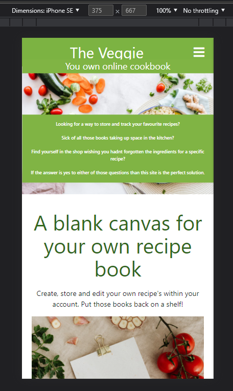

# The Veggie Guy Online Cookbook
## Introuduction
Welcome to my third project. This project is a simple online cookbook that allows users to manage their own recipes remotely. This will use languages such as Django, Python, HTML, CSS and JavaScript.

This project will show the use of CRUD functionality (Create, Read, Update, Delete). The user will be able create, read, update and delete their user profile and table booking.

A live website can be found <a href="https://cook-book-antony.herokuapp.com/home" target="_blank">here</a>.

# Table of Contents

* 1. UX
    * 1.1. Strategy
        * Project Goals
            * User Goals:
            * User Expectations:
            * Trends of Modern Websites
            * Strategy Table
    * 1.2. Structure
    * 1.3. Skeleton
    * 1.4. Surface
* 2. Features
* 3. Technologies Used
* 4. Testing
* 5. Development Cycle
* 6. Deployment
* 7. End Product
* 8. Known Bugs
* 9. Credits

# 1.UX
#### [Go To Top](#table-of-contents "Go To Top")
# **************Update this

The project will give the user an easy way to store, update, delete and edit stored recipe's. Either personal or external.

## 1.1 Strategy
#### [Go To Top](#table-of-contents "Go To Top")

### Project Goals
The main goal of this project is to allow the user to sign up, sign in/out, create/update a user profile and create/update/delete a personal recipes in one place.

The website should:
* Promote a brand of cooking untensils
* Allow the user to create a profile
* Within this profile the user should be able to create and save their own recipes and the assoicated information

### User Goals:

First Time Visitor Goals

* The user should be able to view a selection of tools
* The user should be able to register an account
* The user should be able to create and store recipes
* The user should be able to delete and edit recipes they have created
* The user should be able to browse community approved recipes
* The user should be able to log into their profile on any device and easily view their recipes

Returning Visitor Goals
* The user should be able to view a selection of tools
* The user should be able to log into their account
* The user should be able to create and store recipes
* The user should be able to delete and edit recipes they have created
* The user should be able to browse community approved recipes
* The user should be able to log into their profile on any device and easily view their recipes

### User Expectations:
The system should have a simple user interface, with the navigation to each section clear and concise.

* Each page is clear to read.
* The user interface is easy to navigate.
* The website is responsive on all devices.

## 1.2 Structure
#### [Go To Top](#table-of-contents "Go To Top")

It is really important to include responsive design in this project as many users are using different devices (mobile, tablet, laptop/PC). This gives the user the best experience on their device.

* Responsive on all device sizes
* Easy navigation through labelled buttons
* All elements will be consistent including font size, font family, colour scheme.

## 1.3 Skeleton
#### [Go To Top](#table-of-contents "Go To Top")

## Sitemap

## Wireframes

### Base Template

### Home Pages

### Cooking Tools Pages

### Community Recipes Pages

### My Recipe Pages

### Profile Pages - On Load

### Profile Pages - List Item 1

### Profile Pages - List Item 2

### Profile Pages - List Item 3

## 1.4 Surface
#### [Go To Top](#table-of-contents "Go To Top")

### Font and colors:
Colors used can be found <a href="https://materializecss.com/color.html" target="_blank">here</a>.

Fonts used have been pulled through using materializecss.

# ************ add more informatin on colour choices

# 2. Features
#### [Go To Top](#table-of-contents "Go To Top")

## Navigation

* The navigation bar has two layouts. One view for a desktop and the other for mobile.

* The desktop view uses a traditional layout utilising materialisecss default navigation. The user should clearly find all navgational pages at the top right.

* As with the desktop view the mobile uses existing css code but compreses the links into a colapsable element at the top right. The user should be able to open the element and see all the available links.

## Home Page

* The home page is the main landing page for the site. When the user visits the page they should be able to understand what the website is about and what it can offer them.
* The page presents information as its primary feature.  

## Cooking tools

* The cooking tools page is the primary revenue generator for the website.
* The owner wants to sell a brand of tools.
* The tools page has a series of card elements that display information about a tool as well as its price and where to buy.

## Community Recipes
* The community recipes page will display all of the "approved for community" user approved recipes.
* The user will be able to search for key words included in recipes.
* The recipe's will display in a card that can be opened to display more information.
* The user should be able to decide whether they want their username to display or not. If they opt out it will show as private but the recipe can still be seen.

## Register

* The register page is a key feature of the website. The user should be able to register an account on the website.
* The account should always have a unique username for personal and security purposes.
* Because the website has no features that utalise the users email address at time of writing there is no check for duplicate emails.
* Without registering certain pages of the site will be blocked from accessing. See [SiteMap](#sitemap "Sitemap") for more information.
* The user needs to add; an unique username, a password and an email address.

## Login
* Once an account has been registered the user should be able to log into their account and manage the recipes they have created or would like to create.

## My Recipe's
* This page will have a similar layout to the community page but when the card opens a lot more information about the recipe will be presented.

## Profile
* This page will have the most interactive features of the site.
* The page will be made up of 3 list items; Create a recipe, edit/delete a recipe and see the users information
* The 1st list item will open to a form where the user can submit a new recipe along with the desired information
* The 2nd list item will display all of the recipes the user has created and display all of the information submitted.
* Within the 2nd list item the user can edit a recipe opening up a form or delete the recipe completely.
* The 3rd list item will show all the current session user and email address

## Features left to implement
* Star Rating system - I origionally wanted to add in a star rating system. 
I found some code online (See CSS file) but I wasnt well equipped enough 
to write the Python code to accomodate this so I have added this to the 
future learning points section.

* Improved delete recipe functionality - Currently uses javascript to display 
a message but would like to add a proper warning/confirmation message.

* Add a star rating system to the community recipes - As well as tool ratings this
can be applied to community recipes and then pulled through to the manage recipe's 
page of the user.

* Unique categories on my recipes - I tried with CI help to get a list of unique 
categories to display for each user but I couldnt get it working in time for submission. 
See below two images for details. Instructions can also be seen in the 
"recipes_html_unique_categoriesl.txt" file.

https://github.com/Antony-Thornton/MS3---Online-Cookbook/blob/main/recipes_html_unique_categoriesl.txt.

# 3. Technologies Used
#### [Go To Top](#table-of-contents "Go To Top")

* <a href="https://html.com/html5/" target="_blank">HTML 5</a>  
    * The project uses HyperText Markup Language
* <a href="https://en.wikipedia.org/wiki/CSS" target="_blank">CSS3</a>
    * The project uses Cascading Style Sheets 
* <a href="https://www.javascript.com/" target="_blank">JavaScript</a>
    * The project uses JavaScript
* <a href="https://www.python.org/" target="_blank">Python</a>
    * The project uses Python
* <a href="https://materializecss.com/" target="_blank">Materialize</a>
    * The project uses Materialize css structuring

* <a href="https://balsamiq.com/wireframes/" target="_blank">Balsamiq Wireframes</a>
    * Balsamiq was used to create the wireframes during the design process
* <a href="https://www.gitpod.io/" target="_blank">Gitpod</a>
    * The project uses Gitpod
* <a href="https://github.com/" target="_blank">GitHub</a>
    * GitHub was used to store the project's code after being pushed from Git
* <a href="https://www.heroku.com/" target="_blank">Heroku</a>
    * The project uses Heroku to host the website
* <a href="https://www.google.co.uk/chrome/" target="_blank">Chrome</a>
    * The project uses Chrome to debug and test the source code using HTML5
* <a href="https://beautifier.io/" target="_blank">Code beutifier</a>
    * Corrects Javascript/HTML/CSS code with correct spacing/lines etc.

# 4. Testing
#### [Go To Top](#table-of-contents "Go To Top")

* Testing has been based on a minimum size of an iPhone SE and a maximum width of 1440px as per my mentors advice. Custom CSS has been created to accomodate multiple screen sizes

* Python Code in the app.py file has been validated by using <a href="http://pep8online.com/" target="_blank">PEP8 Online</a>

* HTML code has been validated using <a href="https://validator.w3.org/" target="_blank">W3C Markup Validation Service</a>

* CSS code has been validated using <a href="https://jigsaw.w3.org/css-validator//" target="_blank">W3C CSS Validation Service</a>

### iPhone SE

### 1440p

# Code validation

## Responsive Tools
I used <a href="http://ami.responsivedesign.is/" target="_blank">Am I Responsive</a> to make sure that all my pages are responsive to all devices.

## Javascript
I used <a href="https://jshint.com/" target="_blank">JS Hint</a> to check for any errors within my JavaScript script tags. 

JS Hint showed no warnings.

## PEP8 Online results

## HTML Validator results

| Page | Date Checked | Result | Comment
| :--- | :--- | :--- | :-- 
| Home.html | 16/03/2022 | Pass |
| Tools.html | 16/03/2022 | Pass |
| Community.html | 16/03/2022 | Pass 
| Login.html | 16/03/2022 | Pass 
| Register.html | 16/03/2022 | Pass 
| Logout.html | n/a | n/a
| Profile.html | 16/03/2022 | Pass | Python related error's. Mentor advised to ignore
| Recipes.html | 16/03/2022 | Pass | Python related error's. Mentor advised to ignore

## Profile

## Recipe

## CSS Validator results
| Page | Date Checked | Result | Comment
| :--- | :--- | :--- | :-- 
| style.css | 16/03/2022 | Pass | n/a

## CSS Manual Testing

I have tested my site on Safari and google chrome on multiple devices.

These include:

* iPhone X
* iPhone XS Max
* iPad Pro
* MacBook Pro
* Please find below my testing process for all pages via mobile and web:

## Navigation Bar
All Pages:

| Page | Outcome | Result 
| :--- | :--- | :--- 
| Home.html | Link should send user to the Home Page. |
| Tools.html | Link should send user to the Tools Page. |
| Community.html | Link should send user to the Community Recipes Page. |
| Login.html | Link should send user to the Login Page. The login/register nav elements should not display. Profile, My recipe's and Logout should then be visible to the user. |
| Register.html | Link should send user to the Register Page. |
| Logout.html | Link should log the user out, display the Login and Register nav elements and hide profile, My recipe's and Logout | 
| Profile.html | Link should send user to the Profile Page.
| Recipes.html |  Link should send user to the Recipe's Page. | 

## Footer Links
All Pages:

| Page | Outcome | Result 
| :--- | :--- | :--- 
| Home.html | All of the links should open to the correct website. Pexels, my github profile, BBC good foods and the lakeland website | 
| Tools.html | All of the links should open to the correct website. Pexels, my github profile, BBC good foods and the lakeland website | 
| Community.html | All of the links should open to the correct website. Pexels, my github profile, BBC good foods and the lakeland website | 
| Login.html | All of the links should open to the correct website. Pexels, my github profile, BBC good foods and the lakeland website | 
| Register.html | All of the links should open to the correct website. Pexels, my github profile, BBC good foods and the lakeland website | 
| Profile.html | All of the links should open to the correct website. Pexels, my github profile, BBC good foods and the lakeland website | 
| Recipes.html |  All of the links should open to the correct website. Pexels, my github profile, BBC good foods and the lakeland website | 

## Home Page
| Test | Outcome | Result 
| :--- | :--- | :--- 
HTML elements | All elements should display as intended. | 
Page Scaling | The page should display clearly and as intended when page width is reduced. |

## Tools Page

| Test  | Outcome | Result 
| :--- | :--- | :--- 
HTML elements | All elements should display as intended. | 
Page Scaling | The page should display clearly and as intended when page width is reduced. |
Tool containers | Each of the tool descriptions and links should be correct. |

## Community Page
| Test | Outcome | Result 
| :--- | :--- | :--- 
HTML elements | All elements should display as intended. | 
Page Scaling | The page should display clearly and as intended when page width is reduced. |
Search Button | The search bar should display no recipes with a no results found message when a match is not found. |
Search Button | The search bar should display some recipes based on key words in any of the recipes. i.e. "Egg". |
Reset Button | The reset button should reload the page clearing any searches.|
Open Button | The open button should open a materialize card where recipe information will be displayed.|
Close Button | The close button within this card should then return the card to its previous state. |

## Register Page
| Test | Outcome | Result 
| :--- | :--- | :--- 
Username Text Input | The username should be able to put in a user name of their choice.|
Password Text Input | The username should be able to put in a password of their choice. When validated the password should not be accepted unless its between 5 and 15 characters in length and has a capital letter. |
Register Button | The register button should submit a check to mongo to see if the user name exists. If it does a message saying username already exists. |
Register Button Required fields | If any of the text inputs is blank the form should not submit. |
Register Button | If everything passes the above checks the page should login successfully and display the associated navigation elements and open the profile page with no recipes in the manage recipes list item. |

## Login Page
| Page | Outcome | Result 
| :--- | :--- | :--- 
Username Text Input | The username should be able to put in the username they created|
Password Text Input | The username should be able to put in the password for their account. | 
Login Button Required fields | If any of the text inputs is blank the form should not submit. |
Login Button | If everything passes the above checks the page should login successfully and display the associated navigation elements and open the profile page with any stored user recipes in the manage recipes list item. |

## My Recipe's Page
| Page | Outcome | Result 
| :--- | :--- | :--- 
HTML elements | All elements should display as intended. | 
Page Scaling | The page should display clearly and as intended when page width is reduced. |
Search Button | The search bar should display no recipes with a no results found message when a match is not found. |
Search Button | The search bar should display some recipes based on key words in any of the recipes. i.e. "Egg". |
Reset Button | The reset button should reload the page clearing any searches.|
Open Button | The open button should open a materialize card where recipe information will be displayed.|
Close Button | The close button within this card should then return the card to its previous state. |

## Profile Page
| Page | Outcome | Result 
| :--- | :--- | :--- 
HTML elements | All elements should display as intended. | 
Page Scaling | The page should display clearly and as intended when page width is reduced. |
List Elements | Each list element should open and display its contents. |
List element 1 | The first element should open and show a submit recipe form. |
Submit form | When used the submit form should submit a user recipe to the mongoDB site. This should then be displayed when the page is refreshed. |
List element 2 | The second element should open and show all of the users stored recipes. |
Edit recipe form | When used the edit form button is pressed a new form should be displayed. The users changes should then be submitted to the mongoDB site. The changes should then be displayed when the page is refreshed. |
Delete recipe button | When the delete recipe button is clicked javascript should show a warning with a second delete button. When clicked the recipe should be deleted when the page is refreshed.|
List element 3 | The third element should open and display the users email and username. |

# 5. Developement Cycle
#### [Go To Top](#table-of-contents "Go To Top")

* Install supporting python libraries
    * Install PyMongo and Flask.
    * Create the requirements.txt file. This includes the project's dependencies allowing us to run the project in Heroku

* Create new Heroku app
    * Sign into Heroku
    * Select New
    * Select create new app
    * Enter a relevant app name
    * Select appropriate region
    * Select the create app button

* Prepare the environment and app.py file
    * Create env.py file
    * Add DATABASE_URL with the URL from Heroku
    * Add SECRET_KEY with a randomly generated key
    * Add SECRET_KEY and generated key to the config vars in Heroku
    * Replace insecure key with the environment variable for the SECRET_KEY
    * Add Heroku database as the back end
    * Migrate changes to new database

# 6. Deployment
#### [Go To Top](#table-of-contents "Go To Top")

 I used the terminal to deploy my project locally. To do this I had to:

  1. Create a repository on GitHub.
  2. Clone the repository on your chosen source code editor (GitPod in my case) using the clone link.
  3. Open the terminal within GitPod
  4. Enter "python3 app.py" into the terminal.
  5. Go to local host address on my web browser.
  6. All locally saved changes will show up here.

For the final deployment to Heroku, I had to:

  1. Set debug = False in my app.py file.
  2. Commit and push all files to GitHub
  3. In the deploy tab, go to the manual deploy sections and click deploy branch.

# 7. End Product
#### [Go To Top](#table-of-contents "Go To Top")

# 8. Known Bugs
#### [Go To Top](#table-of-contents "Go To Top")

### Breakdown
* <a href="https://github.com/Dogfalo/materialize/issues/1427" target="_blank">Scaling bug</a> - There is a bug in the materialize css code that causes scaling issue on the profile page. I worked with tutor support and they provided a fix that forced a hidden element brought over by materialize to be 100%. Previously under random circumstances the width of a hidden div would be fixed at 487px and not scale correctly.
    * Code Institute Tutor Bug Feedback - "We can assume it's related to Materialize and resizing textareas, but it's only an issue in Dev Tools.
Unless there are other scripts you've included?
In the end I don't think it's something to be worried about if it's not impacting your site during regular use. Definitely something for the README if you can't pinpoint a fix" 
    * https://stackoverflow.com/questions/30609388/why-my-meteor-app-create-hiddendiv-common-div-tags
* Various issues with naming
Due to a course break and a lack of initial understanding of the course material a lot of the python naming was  incorrect and or incosistent that lead to bugs that needed to be fixed with CI's help. This caused most of the  problems I had
* Elements expanding outside of their container 
    * Links in the profile cards had to be shortened due but this made the card look tidier anyway
    * Headers stretching the page when changing size
* Forms not submitting correctly or at all
* Materialize elements not changing size
* Not being able to load the preview
    * After the course break I couldnt load the preview because heroku had set the link to suspended
* Losing the app.py file and other elements when opening a workspace
    * I had to work with CI to understand that workspaces exist and that I had to pin and reload each time - https://gitpod.io/workspaces
* Open floating outside of the card bug 
    * Moved to center of card instead
        

# 9. Credits
#### [Go To Top](#table-of-contents "Go To Top")

## Code

* <a href="https://materializecss.com/" target="_blank">Website structure and inspiration</a>

* <a href="https://stackoverflow.com/questions/30523370/javascript-expand-collapse-button" target="_blank">Toggle buttons</a>

* <a href="https://materializecss.com/collapsible.html" target="_blank">Collapsible Elements</a>

## Content

* <a href="https://www.lakeland.co.uk/" target="_blank">LakeLand for tool page cotent</a>

* Recipe Idea's - <a href="https://www.bbcgoodfood.com/" target="_blank">BBC Good Food</a>

* <a href="https://www.pexels.com/" target="_blank">For pictures</a> - Artists can be found <a href="https://github.com/Antony-Thornton/MS3---Online-Cookbook/tree/main/static/assets/images">here</a>.

## Project Acknowledgements
* Code Institue Tutor Support - For directing me to the correct solutions for any bugs.

* My Mentor - For his constructive criticism and always pushing me to go further to develop my skills.
